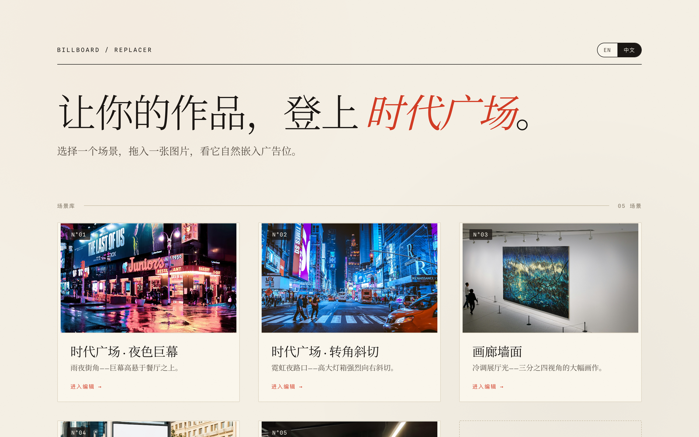

<p align="center">
  <a href="./README.md">简体中文</a> · <b>English</b>
</p>

<h1 align="center">YouAreStar · Billboard Replacer</h1>

<p align="center">Put your work up on a Times Square billboard.</p>

A browser tool that composites your image into a billboard's ad surface via a **homography (perspective) warp** plus **Reinhard color matching** — so the result reads as if it were always there, not pasted on.

<p align="center"></p>

## ✨ Features

- **Perspective fit** — a 4-point homography warps your image onto the ad surface's geometry
- **Color match** — Reinhard lαβ color transfer adapts your image to the scene's light, with adjustable strength
- **Two modes** — preset scenes (corners pre-annotated) or custom upload (drag four handles to mark the surface)
- **Occlusion mask** — keep foreground (lamp posts, people) in front of the ad; paint by brush or import a PNG / cutout (alpha-aware)
- **Manual grade** — brightness / contrast / saturation / temperature / blend mode / edge feather / grain
- **WYSIWYG export** — the same WebGL shader drives preview and export, so the full-resolution PNG equals what you see
- **Bilingual UI** — 中文 / English, remembered across sessions
- **Frontend-only** — no backend; host it as static files

## 🚀 Quick start

```bash
npm install
npm run dev        # dev server at http://localhost:5173
npm run build      # build → dist/
npm run preview    # preview the production build locally
```

## 🧱 Stack

React 18 · Vite 5 · TypeScript · raw WebGL (a single full-screen pass: warp + color + mask + grain in one draw) · framer-motion. No CSS framework, no backend.

## 📦 Deploy

Pure static site: `npm run build` produces `dist/`; serve the **contents** of `dist/` from any static host (nginx / object storage / CDN). The repo ships a `deploy.sh` (local build + incremental `rsync` to your server); the server address lives in a git-ignored `deploy.env` (see `deploy.env.example`), so nothing sensitive is committed.

## 📂 Project layout (key parts)

| Path | Role |
| --- | --- |
| `src/lib/webgl/` | shaders + renderer (everything in one draw) |
| `src/lib/homography.ts` | 4-point DLT for the homography matrix |
| `src/lib/color.ts` | lαβ color stats (CPU side, kept in sync with the shader) |
| `src/hooks/useEditor.ts` | editor state, single source of truth |
| `src/data/billboards.json` | preset scene data |

## 📄 License

Unspecified (private). To open-source, add a `LICENSE` (e.g. MIT).
